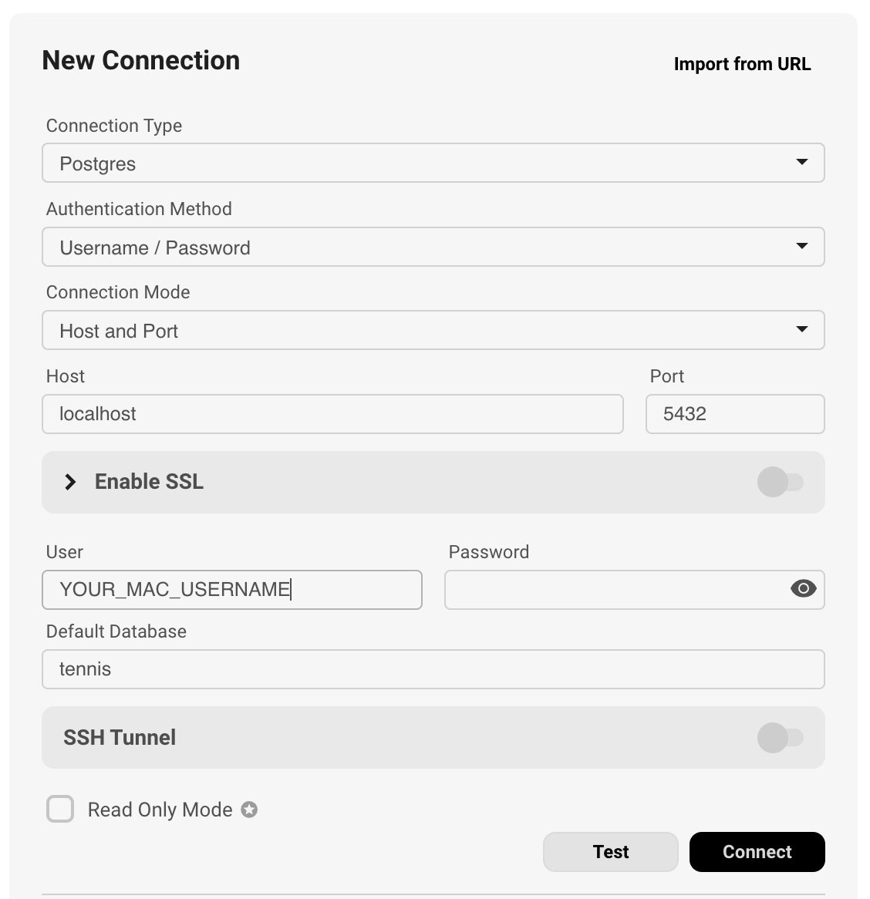

# tennis
## Database

Open Terminal

Install brew if you don't have it:

    /bin/bash -c "$(curl -fsSL https://raw.githubusercontent.com/Homebrew/install/HEAD/install.sh)"

Install PostgreSQL locally

    brew install postgresql

Run the DB engine

    brew services start postgresql

Create the tennis DB

    createdb tennis

Run this:

    psql -l

You should see 'tennis' in the list of databases.

It helps to have a Database GUI to pore through the records.  I like Beekeeper Studio.  It's free. https://www.beekeeperstudio.io/ 

## Python

Install Python: https://www.python.org/downloads/

Then upgrade pip

    python3 -m pip install --upgrade pip

Install python libraries used in the scripts:

    pip3 install pandas sqlalchemy psycopg2-binary

Import data from the CSV files into the database.  Clone this repo, and go to the `db_import` directory in terminal

    python3 import_td_atp.py

    python3 import_ta_atp.py

    python3 import_td_wta.py

    python3 import_ta_wta.py

## What is happening

### Generating the data set

There are four CSV files in the `spreadsheet_raw` directory which contain all WTA and ATP tennis matches from tennis-data.co.uk and tennis abstract https://github.com/JeffSackmann/tennis_atp https://github.com/JeffSackmann/tennis_wta.  The two sources have similar buf slightly different data about the matches.  The tennis-data records have the betting odds and the tennis abstract data has things like duration, service holds/breaks, aces etc.. so we need to coalesce these two data sources together to create a holistic view of each tennis match.  We import the womens and mens CSVs for both into separate database tables and then join them using common matching fields using strict_match_atp.py and strict_match_wta.py

### Generating ELO ratings for each player

The entire generated data set is iterated and an ELO rating is calculated for each player using the create_elo_ratings.py script.  When ordered by the Overall rating this should generally resemble the list of names here: https://tennisabstract.com/reports/atp_elo_ratings.html (not necessarily the numbers though).

The ELO rating incorporates:

- a dynamic K factor adjusted for how many matches the player has played
- separate surface specific ratings which are blended with the player's overall rating using logarithmic weighting
- rating decay due to inactivity
- decay from last played match up until the date the ratings are generated
- The ELO compounds over the full period - there's no rolling window

prediction models

create ELO for each player factoring in:
- surface adjustment: (w × Surface Rating) + ((1 − w) × Overall Rating) => w is based on the number of matches played on that surface.
- decay for inactivity
- additional decay from last match played up until current date

Only consider betting if a player has at least 5 recent matches AND 25+ career matches.

If surface matches < 3 in the last 12 months, ignore surface-specific adjustments (small sample size).

Per match played:
- number of aces
- number of doubles faults
- number of serve points
- number of first serves made
- number of first-serve points won
- number of second-serve points won
- number of serve games
- number of break points saved
- number of break points faced
- minutes

Approach: Blend Career & Recent Form
We can weight ratings using a decaying factor:

Blended Elo=(α×Recent Elo)+((1−α)×Overall Elo)
Recent Elo: Last 6 months (or last 10 matches, whichever is greater).
Overall Elo: Lifetime rating.
Alpha (Recency Weight): 0.65 (for fast-changing players) or 0.35 (for consistent players like Djokovic).