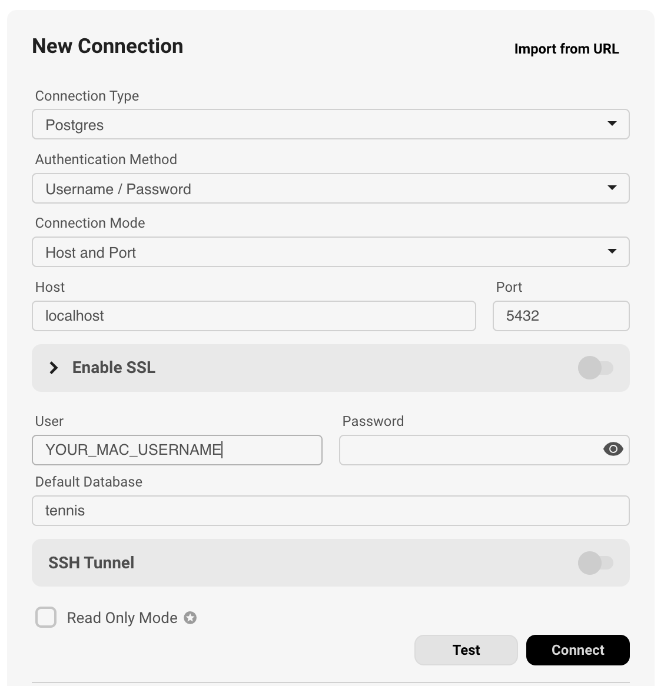

# tennis

# Current Model Evaluation

## ✅ Final Model Performance (With Odds Features)

| Metric           | Value   |
|------------------|---------|
| Accuracy         | 67.32%  |
| Log Loss         | 0.5978  |
| ROC-AUC Score    | 0.7395  |

---

## 📊 Feature Importance (Top Features)

| Rank | Feature                  | Importance |
|------|--------------------------|------------|
| 1    | p1_odds_shape_strength   | 0.090624   |
| 2    | p2_odds_shape_strength   | 0.083602   |
| 3    | glicko_diff              | 0.070858   |
| 4    | p2_odds_shortened_fav    | 0.042230   |
| 5    | p1_odds_shortened_fav    | 0.039770   |
| 6    | elo_diff                 | 0.036690   |
| 7    | glicko_surface_diff      | 0.035750   |
| 8    | p1_odds_shape_flat       | 0.035682   |
| 9    | p2_odds_shape_flat       | 0.026716   |
| 10   | surface_elo_diff         | 0.019953   |
| 11   | avg_elo_faced_diff       | 0.015919   |
| 12   | p1_odds_shape_mixed      | 0.015676   |
| 13   | tournament_strength      | 0.015612   |
| 14   | recent_matches_30d_diff  | 0.015462   |
| 15   | tournament_fatigue_diff  | 0.015231   |

---

## 📉 XGBoost Historical Ratings Only (No Odds Features)

| Metric           | Value   |
|------------------|---------|
| Accuracy         | 64.48%  |
| Log Loss         | 0.6194  |
| ROC-AUC Score    | 0.7106  |


## Database

Open Terminal

Install brew if you don't have it:

    /bin/bash -c "$(curl -fsSL https://raw.githubusercontent.com/Homebrew/install/HEAD/install.sh)"

Install PostgreSQL locally

    brew install postgresql

Run the DB engine

    brew services start postgresql

Create the tennis DB

    createdb tennis

Run this:

    psql -l

You should see 'tennis' in the list of databases.

It helps to have a Database GUI to pore through the records.  I like Beekeeper Studio.  It's free. https://www.beekeeperstudio.io/ 



## 📌 Python Setup

### 1️⃣ Install Python 3 (Mac)
    brew install python3

### 2️⃣ Install required dependency for XGBoost (Mac)
    brew install libomp

### 3️⃣ Create a virtual environment (Recommended)
    python3 -m venv venv

### 4️⃣ Activate virtual environment
#### (Mac/Linux)
    source venv/bin/activate
#### (fish shell)
    source venv/bin/activate.fish
#### (Windows PowerShell)
    venv\Scripts\Activate.ps1
#### (Windows Command Prompt)
    venv\Scripts\activate.bat

### 5️⃣ Upgrade pip
    pip install --upgrade pip

### 6️⃣ Install required Python packages
    pip install -r requirements.txt

> **💡 Alternative:** If `requirements.txt` is missing, install manually:
> ```sh
> pip install pandas sqlalchemy psycopg2-binary scikit-learn xgboost optuna pymc
> ```

---

## 📌 Data Preparation

### 7️⃣ Import data from CSV files into the database
    python import_spreadsheet_data.py

### 8️⃣ Join ATP match records
    python join_records_atp.py

### 9️⃣ Create structured table for model processing
    python create_atp_matches_table.py

### 🔟 Match Betfair odds intervals to matches
    python join_betfair_odds.py

### 1️⃣1️⃣ Populate analysis table with computed features
    python create_analysis_data.py

### 1️⃣2️⃣ Create final model input dataset
    python create_data_feed_table.py

---

## 📌 Model Training & Testing

### 1️⃣3️⃣ Train the XGBoost Model
    python get_hyperparameters.py
    python xg_sensible.py

> **💡 Note:** Does this save the model? If yes, where? If no, should we load a previous model instead?

---

✅ **Final Step:** Add `venv/` to `.gitignore`  
    ```sh
    echo "venv/" >> .gitignore
    ```

## Incorporate the odds

### 1️⃣ Shape the betfair data into features
    python betfair_analysis.py

### 2️⃣ Move odds features into the structured feature table
    python create_odds_features.py

### 3️⃣ Create separate data feed table for the model incorporating the odds
    python create_data_feed_table_odds.py

### 4️⃣ Calculate separate hyperparameters for the odds inclusive model
    python get_odds_hyperparameters.py

### 5️⃣ Train a model to incorporate market data into the historical model
    python xg_sensible_odds.py

## What is happening

### Generating the data set

There are four CSV files in the `spreadsheet_raw` directory which contain all WTA and ATP tennis matches from tennis-data.co.uk and tennis abstract https://github.com/JeffSackmann/tennis_atp https://github.com/JeffSackmann/tennis_wta.  The two sources have similar buf slightly different data about the matches.  The tennis-data records have the betting odds and the tennis abstract data has things like duration, service holds/breaks, aces etc.. so we need to coalesce these two data sources together to create a holistic view of each tennis match.  We import the womens and mens CSVs for both into separate database tables and then join them using common matching fields using strict_match_atp.py and strict_match_wta.py

### Generating ELO ratings for each player

The entire generated data set is iterated and an ELO rating is calculated for each player using the create_elo_ratings.py script.  When ordered by the Overall rating this should generally resemble the list of names here: https://tennisabstract.com/reports/atp_elo_ratings.html (not necessarily the numbers though).

The ELO rating incorporates:

- a dynamic K factor adjusted for how many matches the player has played
- separate surface specific ratings which are blended with the player's overall rating using logarithmic weighting
- rating decay due to inactivity
- decay from last played match up until the date the ratings are generated
- The ELO compounds over the full period - there's no rolling window
- Serve / Return strength adjustment
- Adjustment for tie breaks to account for close matches


prediction models

create ELO for each player factoring in:
- surface adjustment: (w × Surface Rating) + ((1 − w) × Overall Rating) => w is based on the number of matches played on that surface.
- decay for inactivity
- additional decay from last match played up until current date

Only consider betting if a player has at least 5 recent matches AND 25+ career matches.

If surface matches < 3 in the last 12 months, ignore surface-specific adjustments (small sample size).

Per match played:
- number of aces
- number of doubles faults
- number of serve points
- number of first serves made
- number of first-serve points won
- number of second-serve points won
- number of serve games
- number of break points saved
- number of break points faced
- minutes

Approach: Blend Career & Recent Form
We can weight ratings using a decaying factor:


Blended Elo=(α×Recent Elo)+((1−α)×Overall Elo)
Recent Elo: Last 6 months (or last 10 matches, whichever is greater).
Overall Elo: Lifetime rating.
Alpha (Recency Weight): 0.65 (for fast-changing players) or 0.35 (for consistent players like Djokovic).